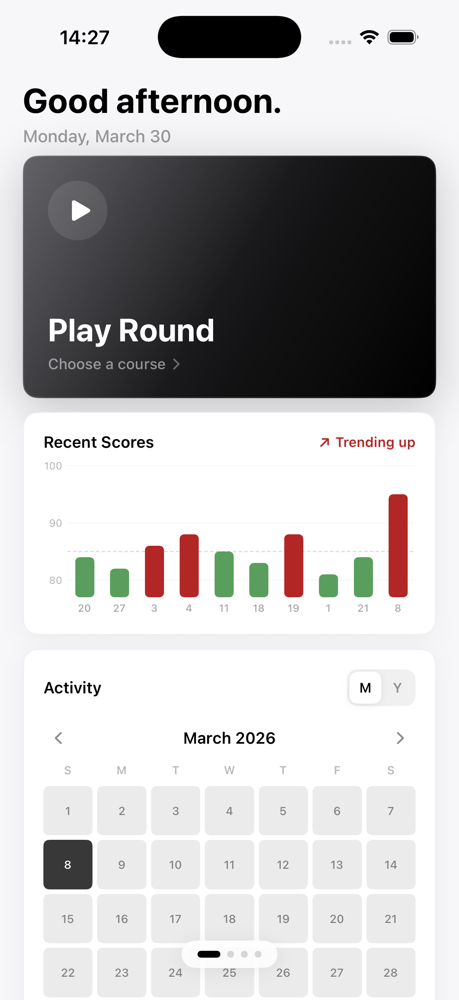
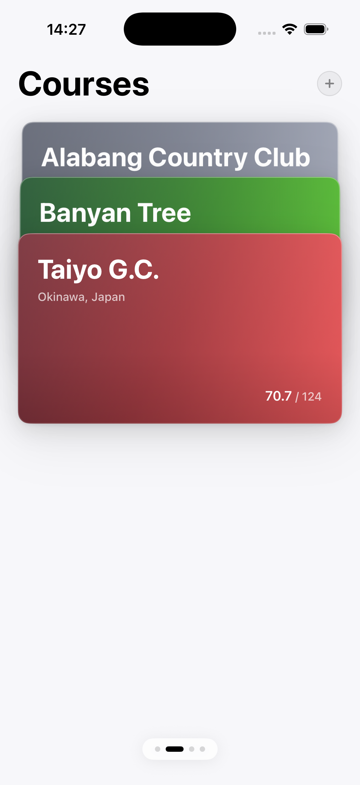
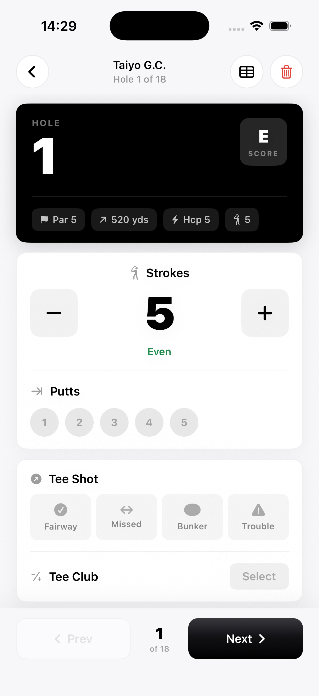
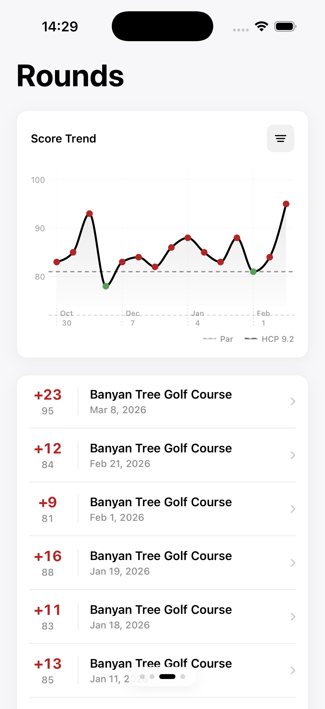
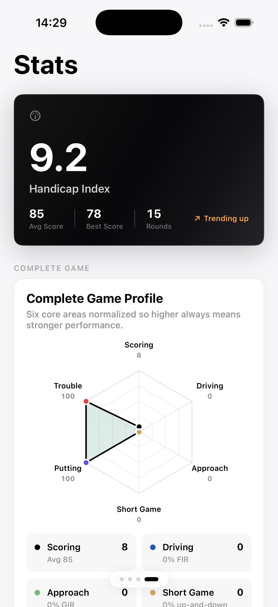
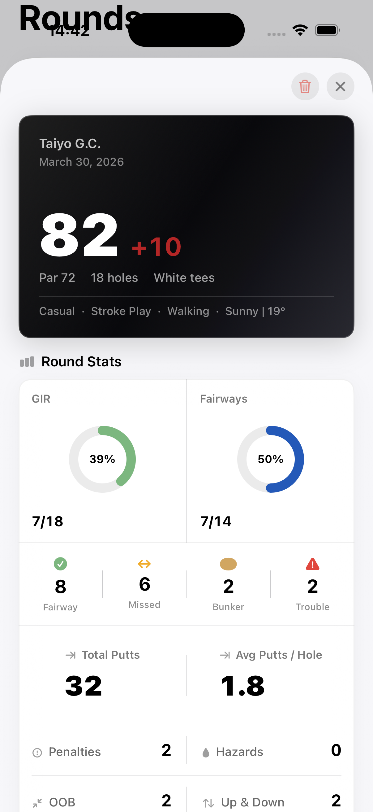

# Scorly

A golf score tracking app for iOS, built with SwiftUI. I wanted something minimal that stays out of the way on the course but still gives me useful stats when I'm done.

## What it does

- Track scores hole-by-hole during a round (strokes, putts, tee shots, approach, penalties, up-and-downs, sand saves)
- View score trends over time with charts and filters
- Career stats: handicap index (WHS), GIR/FIR percentages, putting averages, scrambling rates
- Manage multiple courses with custom tee boxes and hole data
- Activity calendar on the home screen
- Data syncs to Supabase so nothing gets lost

## Screenshots

<p align="center">
  
  
  
  
</p>

<p align="center">
  
  
</p>

## App structure

```
Scorly/
├── App/
│   ├── ScorlyApp.swift              # Entry point
│   └── ContentView.swift            # Swipeable tab container (Home → Courses → Rounds → Stats)
├── Features/
│   ├── Auth/
│   │   └── AuthView.swift           # Sign in / sign up
│   ├── Home/
│   │   ├── HomeView.swift           # Landing page, recent scores bar chart, activity calendar
│   │   ├── CoursesView.swift        # Wallet-style course card stack
│   │   ├── CourseCardView.swift     # Individual course card
│   │   ├── Course.swift             # Course presentation model
│   │   ├── AddCourseSheet.swift     # New course form
│   │   ├── EditCourseSheet.swift    # Edit course form
│   │   ├── RoundFlowView.swift      # Setup → tracker flow wrapper
│   │   ├── RoundSetupView.swift     # Pre-round config (tees, conditions, holes)
│   │   ├── RoundTrackerView.swift   # Hole-by-hole scoring during a round
│   │   └── RoundStore.swift         # Observable store for the active round, persists to UserDefaults
│   ├── Rounds/
│   │   ├── RoundsView.swift         # Score trend line chart + round history list
│   │   ├── RoundDetailView.swift    # Full round detail sheet with scorecard
│   │   ├── RoundSummaryView.swift   # Post-round summary before saving
│   │   └── CompletedRound.swift     # Data model + WHS handicap calculation
│   ├── Shared/
│   │   └── DeleteRoundPopup.swift   # Reusable delete confirmation popup
│   └── Stats/
│       └── StatsView.swift          # Career stats (handicap, accuracy, putting, scrambling)
├── Models/
│   └── LocalModels.swift            # SwiftData models for local caching
└── Services/
    ├── AuthService.swift            # Supabase auth (sign in, sign up, session management)
    ├── DataService.swift            # CRUD for courses, rounds, hole stats
    └── SupabaseClient.swift         # Shared Supabase client + JSON coding
```

## Tech stack

- **SwiftUI** + **Swift Charts** — all UI, no UIKit
- **Supabase** (supabase-swift 2.x) — auth, Postgres database, row-level security
- **SwiftData** — local caching
- **XcodeGen** (`project.yml`) — generates the Xcode project so the `.xcodeproj` stays clean
- iOS 17+, portrait only

## Setup

1. Clone the repo
2. Install [XcodeGen](https://github.com/yonaskolb/XcodeGen) if you don't have it (`brew install xcodegen`)
3. Run `xcodegen` in the project root to generate `Scorly.xcodeproj`
4. Set up a Supabase project and run the migrations in `supabase/migrations/` in order
5. Update the Supabase URL and anon key in `SupabaseClient.swift`
6. Open in Xcode and run

## Notes

- Navigation is swipe-based (paged `TabView`), no tab bar — just a small dot indicator at the bottom
- The round tracker persists to `UserDefaults` so you can kill the app mid-round without losing progress
- Handicap index follows the World Handicap System formula: best N of last 20 differentials, multiplied by 0.96
- Scores are color-coded throughout: green = at or below average, red = above
